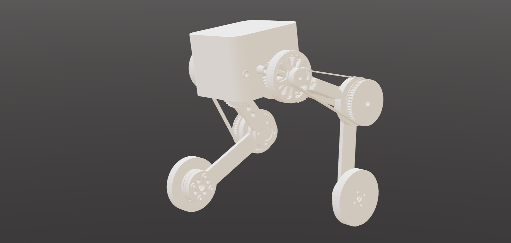

# ria

ria is a small wheeled biped built for jumping and fast ground motion.



### bom

- 2x 5010 260kv bldc
- 2x gbm2804 145kv bldc
- 2x sg90 servo
- control pcb: 4x drv8316rrgfr, esp32-s3-wroom-1-n8, tokmas icm-42688-p, ap63300
- 4x as5600
- funfly 1300 4s lipo
- m2, m3 screws
- 6x 693zz bearings (planet gears)
- 2x gt3 300 mm closed belt

### specs

- 10:1 two stage knee transmission
- 100mm upper and lower legs
- 720g mass
  - 150g/side motors, 200g plastic, 150g battery, 70g everything else
- 20cm jump height, 30kmh top speed (tentative, accurate-ish)

# printed parts
ria is built mostly from parts designed in cadquery. nearly every part has a flat face so it should be easy to 3d print. you'll need some m3 screws of various sizes and some 693 bearings.

```bash
cd models
python3 main.py
```

# pcb
the pcb is a 50x63mm board with an esp32 s3 module built in Backplane (KiCad)

# software
ria is trained and driven in [botblocks.dev](https://botblocks.dev)

```bash
cd software
botblocks import robot bot.json --save myriafork/robot --root ..
botblocks run drive.py
```
